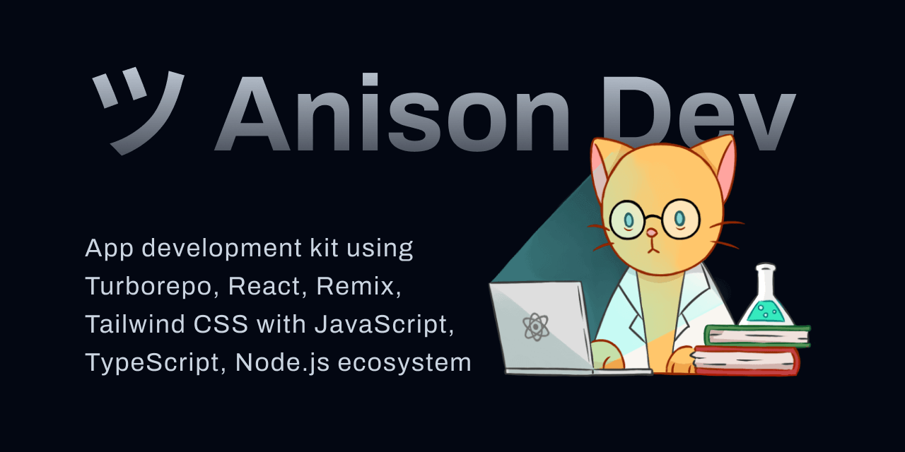

# ツ Anison Dev

[**ツ Anison Dev**](https://github.com/haidar-dev/anison-dev) by [M Haidar Hanif](https://github.com/mhaidarhanif) is an app development kit with Turborepo, React, Remix, Tailwind CSS, Prisma, MySQL on PlanetScale, Vercel, Docker, and more. It's also possible to bring other things from the JavaScript, TypeScript, Node.js ecosystem.

Visit the main demo at [anison.haidar.dev](https://anison.haidar.dev)

The goal is to be more prepared when [building real world apps and ideas](guides/IDEAS.md), ship things fast, also scale the project easily with many moving parts.

This is a highly opinionated collection of software engineering and web development workflow, monorepo project structure, ready to use interactive UI components, functionality hooks and utilities.

If need something simpler without Turborepo, check out [Rewinds](https://rewinds.mhaidarhanif.com).

## Documents

Please read these, ordered by importance:

- [STACK](guides/STACK.md): Chosen stack details
- [ENV](guides/ENV.md): Required environment variables
- [DEVELOPMENT](guides/DEVELOPMENT.md): Development guide and quick start
- [DEPLOYMENT](guides/DEPLOYMENT.md): Deployment guide
- [PROJECT](guides/PROJECT.md): Development guide and project structure
- [IDEAS](guides/IDEAS.md): Thought provoking ideas what to build with this
- [ROADMAP](guides/ROADMAP.md): Feature list and requests
- [REFERENCES](guides/REFERENCES.md): More information

## Extra

### Authors

- [M Haidar Hanif](https://mhaidarhanif.com)
  - [@mhaidarhanif on GitHub](https://github.com/mhaidarhanif)
  - [@mhaidarhanif on Twitter](https://twitter.com/mhaidarhanif)
- [Haidar Dev](https://haidar.dev)
  - [@haidar-dev on GitHub](https://github.com/haidar-dev)

### Licenses

- [MIT License](LICENSE)

### Name and Symbol

Anison means [anime song](https://en.wikipedia.org/wiki/Anime_song), following [Remix Stacks](https://remix.run/stacks) way with music-related names. Or similar with the word "unison", a simultaneous performance of action.

ツ means the Japanese katakana syllable ["tsu"](https://en.wiktionary.org/wiki/%E3%83%84). It looks like an emoticon representing a smiling face.
